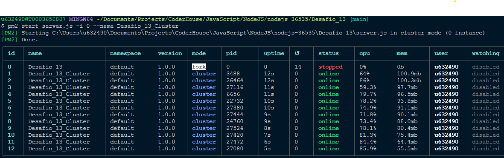
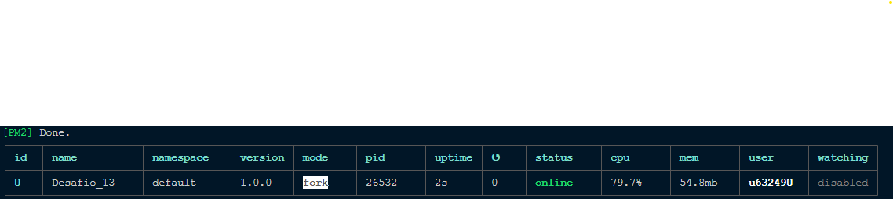
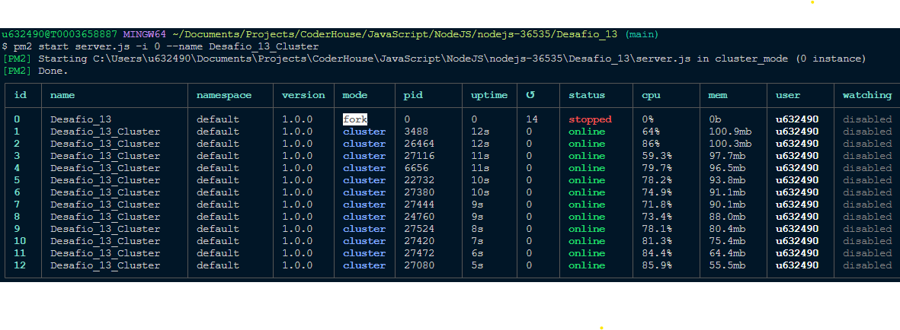

# Instrucciones

Por favor, leer antes de ejecutar.

## Como ejecutar el programa en su computadora:

1. Clonar el repositorio.
2. Dirigirse a la carpeta Desafio_14.
3. Ejecutar "npm install" para instalar las dependecias.
4. Ejecutar "npm run dev" o "npm start".

## Ejemplo del .env

```
MONGODB_CONNECTION_STRING="my_mongodb_connection_string"
MONGO_DATABASE="my_mongo_database"
MONGO_ATLAS_CREDENTIALS="my_mongo_atlas_credentials"
```

##Config de NGINX

```
events {
}

http {
    include mime.types;
    default_type application/octet-stream;

    upstream node_app {
        server 127.0.0.1:8081 weight=3;
        server 127.0.0.1:8082;
        server 127.0.0.1:8083;
        server 127.0.0.1:8084;
        server 127.0.0.1:8085;
    }

    server {
        listen 80;
        server_name mginx_node;
        location /api/randoms {
            proxy_pass http://node_app;
        }
    }
}
```

##Imgs de PM2




